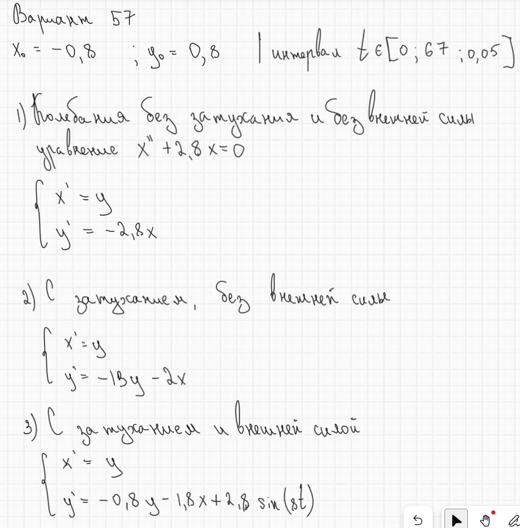

---
## Author
author:
  name: Комягин Андрей Николаевич
  degrees: DSc
  orcid: 0000-0002-0877-7063
  email: 1132236126@rudn.ru
  affiliation:
    - name: Российский университет дружбы народов
      country: Российская Федерация
      postal-code: 117198
      city: Москва
      address: ул. Миклухо-Маклая, д. 6
## Title
title: Лабораторная работа №4
subtitle: Модель гармонических колебаний
license: CC BY
date: today
date-format: "YYYY-MM-DD" # Example: 2025-09-06
---

# Информация

## Докладчик

:::::::::::::: {.columns align=center}
::: {.column width="70%"}

  - Комягин Андрей Николаевич
  - студент НПИбд-01-23
  - Российский университет дружбы народов им. П. Лумумбы

:::
::: {.column width="30%"}

:::
::::::::::::::

# Вводная часть

## Цель

Изучить модель гармонических колебаний. Смоделировать различные ситуации поведения осциллятора.

## Задачи

* Записать системы для построения моделей

* Построить модели:

	* Колебания гармонического осциллятора без затухания и без действия внешней силы
	
	* Колебания гармонического осциллятора с затуханием и без действия внешней силы
	
	* Колебания гармонического осциллятора с затуханием и под действием внешней силы

# Выполнение лабораторной работы

## Условие задачи (вариант 57)

Необходимо построить фазовый портрет гармонического осциллятора и решение уравнения гармонического осциллятора для следующих случаев:

\textbf{1. Колебания гармонического осциллятора без затухания и без действия внешней силы}
$$
\ddot{x} + 2.8x = 0
$$

\textbf{2. Колебания гармонического осциллятора с затуханием и без действия внешней силы}
$$
\ddot{x} + 13\dot{x} + 2x = 0
$$

\textbf{3. Колебания гармонического осциллятора с затуханием и под действием внешней силы}
$$
\ddot{x} + 0.8\dot{x} + 1.8x = 2.8\sin(8t)
$$

На интервале \( t \in [0; 67] \) (шаг 0.05) с начальными условиями \( x_0 = -0.8, \; y_0 = 0.8 \).

## Уравнение гармонического осциллятора 

{height=87%}

## уравнения для каждого из варианта заданий.

{height=87%}

## Результаты

## Сравнение реализаций на Julia и OpenModelica

| Характеристика | Julia | OpenModelica |
|----------------|-------|--------------|
| **Парадигма** | Императивная (последовательное выполнение) | Декларативная (описание уравнений) |
| **Подход к решению** | Явный вызов solve() | Автоматическая интеграция |
| **Математическая запись** | Скрыта в численном методе | Близка к математической нотации |

## Выводы

В ходе выполнения лабораторной работы я изучил модель гармонических колебаний. Смоделировал различные ситуации поведения осциллятора.

