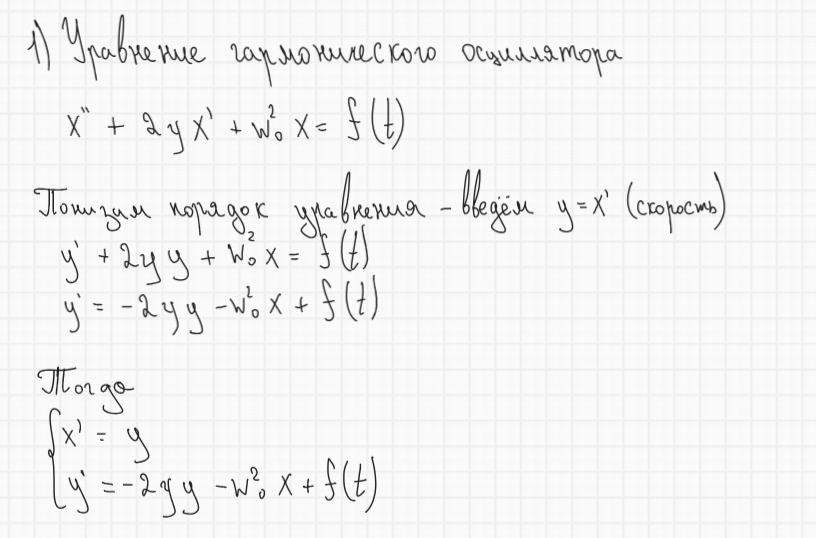
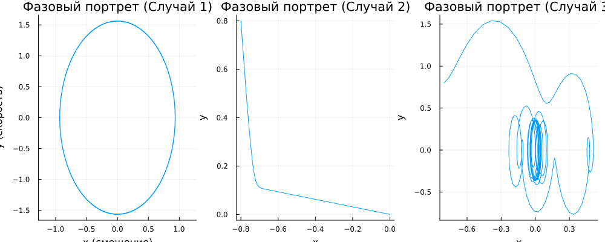

	---
## Author
author:
  name: Комягин Андрей Николаевич
  degrees: DSc
  orcid: 0000-0002-0877-7063
  email: 1132236126@rudn.ru
  affiliation:
    - name: Российский университет дружбы народов
      country: Российская Федерация
      postal-code: 117198
      city: Москва
      address: ул. Миклухо-Маклая, д. 6

## Title
title: "Отчёт по лабораторной работе №4"
subtitle: "Модель гармонических колебаний"
license: "CC BY"
---

# Цель работы

Изучить модель гармонических колебаний. Смоделировать различные ситуации поведения осциллятора.
	
# Задание

* Записать системы для построения моделей

* Построить модели:

	* Колебания гармонического осциллятора без затухания и без действия внешней силы
	
	* Колебания гармонического осциллятора с затуханием и без действия внешней силы
	
	* Колебания гармонического осциллятора с затуханием и под действием внешней силы

# Выполнение лабораторной работы

## Условие задачи (вариант 57)

Необходимо построить фазовый портрет гармонического осциллятора и решение уравнения гармонического осциллятора для следующих случаев:

\textbf{1. Колебания гармонического осциллятора без затухания и без действия внешней силы}
$$
\ddot{x} + 2.8x = 0
$$

\textbf{2. Колебания гармонического осциллятора с затуханием и без действия внешней силы}
$$
\ddot{x} + 13\dot{x} + 2x = 0
$$

\textbf{3. Колебания гармонического осциллятора с затуханием и под действием внешней силы}
$$
\ddot{x} + 0.8\dot{x} + 1.8x = 2.8\sin(8t)
$$

На интервале \( t \in [0; 67] \) (шаг 0.05) с начальными условиями \( x_0 = -0.8, \; y_0 = 0.8 \).


## Уравнение гармонического осциллятора 

Запишем уравнение второго порядка через систему двух уравнений первого порядка([рис. @fig-001]).

{#fig-001 width=70%}


Теперь запишем уравнения для каждого из варианта заданий ([рис. @fig-002]).

{#fig-001 width=70%}

## Листинг программы

Смоделируем ситуацию программно

### Julia

```

using DrWatson
@quickactivate "project" 

using DifferentialEquations
using Plots

# Общие параметры
x0 = -0.8
y0 = 0.8
u0 = [x0, y0]
tspan = (0.0, 67.0)

# СЛУЧАЙ 1: Без затухания, без внешней силы

function osc1!(du, u, p, t)
    # u[1] = x, u[2] = y
    a = 0.0 
    b = 2.8
    
    du[1] = u[2]
    du[2] = -a*u[2] - b*u[1] 
end

prob1 = ODEProblem(osc1!, u0, tspan)
sol1 = solve(prob1, Tsit5(), saveat=0.05)

# Фазовый портрет
p1 = plot(sol1, vars=(1, 2), title="Фазовый портрет (Случай 1)", 
          xlabel="x (смещение)", ylabel="y (скорость)", legend=false, aspect_ratio=:equal)

# СЛУЧАЙ 2: С затуханием, без внешней силы

function osc2!(du, u, p, t)
    a = 13.0
    b = 2.0
    
    du[1] = u[2]
    du[2] = -a*u[2] - b*u[1]
end

prob2 = ODEProblem(osc2!, u0, tspan)
sol2 = solve(prob2, Tsit5(), saveat=0.05)

p2 = plot(sol2, vars=(1, 2), title="Фазовый портрет (Случай 2)", 
          xlabel="x", ylabel="y", legend=false)

# СЛУЧАЙ 3: С затуханием и внешней силой

function osc3!(du, u, p, t)
    a = 0.8
    b = 1.8
    f_t = 2.8 * sin(8*t)
    
    du[1] = u[2]
    du[2] = -a*u[2] - b*u[1] + f_t
end

prob3 = ODEProblem(osc3!, u0, tspan)
sol3 = solve(prob3, Tsit5(), saveat=0.05)

p3 = plot(sol3, vars=(1, 2), title="Фазовый портрет (Случай 3)", 
          xlabel="x", ylabel="y", legend=false)

# Сохранение всех графиков в один файл
plot(p1, p2, p3, layout=(1, 3), size=(1000, 400))
savefig("lab04.png")
println("Графики сохранены")


```

### OpenModelica

#### Случай 1

```

model Lab3_Case1 "Гармонический осциллятор без затухания"
  Real x(start=-0.8);
  Real y(start=0.8);
equation
  der(x) = y;
  der(y) = -2.8 * x;
end Lab3_Case1;

```

#### Случай 2

```

model Lab3_Case2 "Гармонический осциллятор с сильным затуханием"
  Real x(start=-0.8);
  Real y(start=0.8);
equation
  der(x) = y;
  der(y) = -13.0 * y - 2.0 * x;
end Lab3_Case2;

```

#### Случай 3	

```

model Lab3_Case3 "Осциллятор с затуханием и внешней силой"
  Real x(start=-0.8);
  Real y(start=0.8);
equation
  der(x) = y;
  der(y) = -0.8 * y - 1.8 * x + 2.8 * sin(8 * time);
end Lab3_Case3;

```

## Результаты

Посмотрим на графики, которые вышли в каждом из случаев ([рис. @fig-003]).

{#fig-003 width=70%}


## Сравнение реализаций на Julia и OpenModelica

| Характеристика | Julia | OpenModelica |
|----------------|-------|--------------|
| **Парадигма** | Императивная (последовательное выполнение) | Декларативная (описание уравнений) |
| **Подход к решению** | Явный вызов solve() | Автоматическая интеграция |
| **Математическая запись** | Скрыта в численном методе | Близка к математической нотации |


# Выводы

В ходе выполнения лабораторной работы я изучил модель гармонических колебаний. Смоделировал различные ситуации поведения осциллятора.
	

