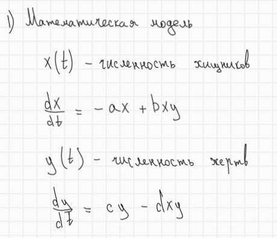
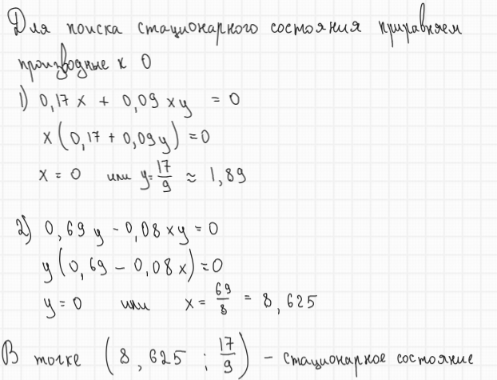

---
## Author
author:
  name: Комягин Андрей Николаевич
  degrees: DSc
  orcid: 0000-0002-0877-7063
  email: 1132236126@rudn.ru
  affiliation:
    - name: Российский университет дружбы народов
      country: Российская Федерация
      postal-code: 117198
      city: Москва
      address: ул. Миклухо-Маклая, д. 6
## Title
title: Лабораторная работа №5
subtitle: Модель хищник-жертва
license: CC BY
date: today
date-format: "YYYY-MM-DD" # Example: 2025-09-06
---

# Информация

## Докладчик

:::::::::::::: {.columns align=center}
::: {.column width="70%"}

  - Комягин Андрей Николаевич
  - студент НПИбд-01-23
  - Российский университет дружбы народов им. П. Лумумбы

:::
::: {.column width="30%"}

:::
::::::::::::::

# Вводная часть

## Цель

Рассмотреть простейшую модель взаимодействия видов "хищник-жертва" Лотки-Вольтерры.

## Задачи

* Изучить модель "хищник-жертва" Лотки-Вольтерры

* Описать систему уравнений

* Смоделировать уравнения

* Проанализировать результат на графике

# Выполнение лабораторной работы

## Модель "хищник-жертва"

{height=87%}

## Условие задачи (вариант 57)

{height=87%}

## Поиск стационарных точек

{height=87%}

## График моделирования

{height=87%}

## Сравнение реализаций на Julia и OpenModelica

| Характеристика | Julia | OpenModelica |
|----------------|-------|--------------|
| **Парадигма** | Императивная (последовательное выполнение) | Декларативная (описание уравнений) |
| **Подход к решению** | Явный вызов solve() | Автоматическая интеграция |
| **Математическая запись** | Скрыта в численном методе | Близка к математической нотации |

## Выводы

В ходе выполнения лабораторной работы мною была рассмотрена простейшая модель взаимодействия видов "хищник-жертва" Лотки-Вольтерры.

