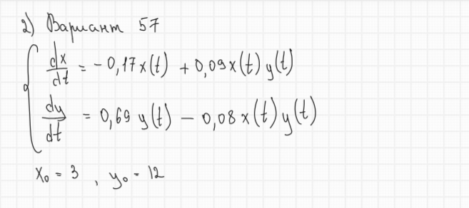
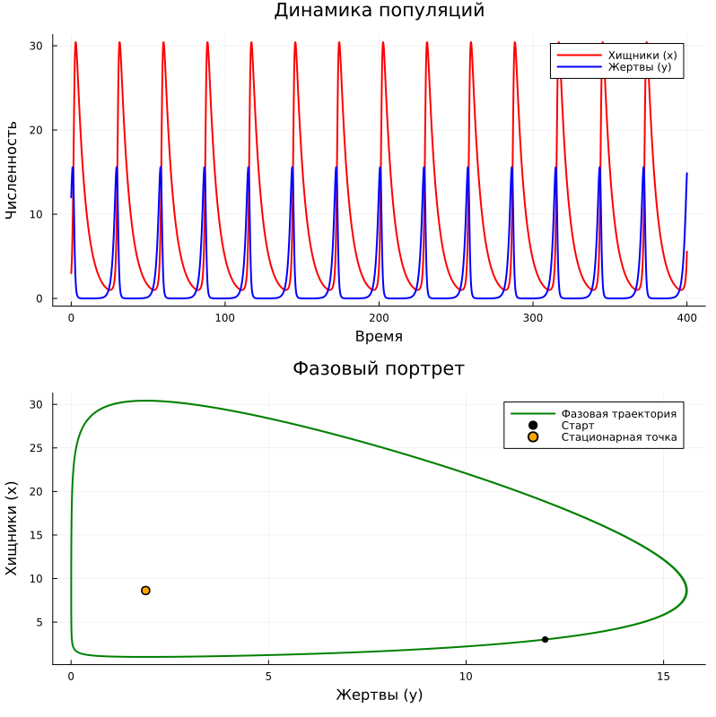

	---
## Author
author:
  name: Комягин Андрей Николаевич
  degrees: DSc
  orcid: 0000-0002-0877-7063
  email: 1132236126@rudn.ru
  affiliation:
    - name: Российский университет дружбы народов
      country: Российская Федерация
      postal-code: 117198
      city: Москва
      address: ул. Миклухо-Маклая, д. 6

## Title
title: "Отчёт по лабораторной работе №5"
subtitle: "Модель хищник-жертва"
license: "CC BY"
---

# Цель работы

Рассмотреть простейшую модель взаимодействия видов "хищник-жертва" Лотки-Вольтерры.
	
# Задание

* Изучить модель "хищник-жертва" Лотки-Вольтерры

* Описать систему уравнений

* Смоделировать уравнения

* Проанализировать результат на графике

# Выполнение лабораторной работы

## Модель "хищник-жертва"

Система уравнений модели "хищник-жертва" Лотки-Вольтерры([рис. @fig-001]).

{#fig-001 width=70%}


## Условие задачи (вариант 57)

Условие задачи представлено на ([рис. @fig-002]).

{#fig-002 width=70%}

## Поиск стационарных точек

Найдём стационарные точки. Для этого можно использовать формулу из инструкции по выполнению лабораторной работы или приравнять производные к 0 ([рис. @fig-003]).

{#fig-003 width=70%}


## График моделирования

Посмотрим на график, который получился в результате моделирования ([рис. @fig-004]).

{#fig-004 width=70%}


## Листинг программы


### Julia

```

using DrWatson
@quickactivate "project"

using DifferentialEquations
using Plots

# начальные условия
x0 = 3.0
y0 = 12.0
u0 = [x0, y0]
tspan = (0.0, 400.0)

# коэффициенты
a = 0.17 # смертность хищников
b = 0.09 # прирост хищников
c = 0.69 # прирост жертв
d = 0.08 # смертность жертв

# система уравнений
function predator_prey!(du, u, p, t)
    x = u[1] # хищники
    y = u[2] # жертвы
    
    du[1] = -a*x + b*x*y
    
    du[2] = c*y - d*x*y
end

prob = ODEProblem(predator_prey!, u0, tspan)
sol = solve(prob, Tsit5(), dtmax=0.1)

# (как в примере лабораторной)
x_val = sol[1, :] # Хищники
y_val = sol[2, :] # Жертвы
time_val = sol.t

# График 1 (численность от времени)
p1 = plot(time_val, x_val, label="Хищники (x)", color=:red, lw=2)
plot!(p1, time_val, y_val, label="Жертвы (y)", color=:blue, lw=2)
title!(p1, "Динамика популяций")
xlabel!(p1, "Время")
ylabel!(p1, "Численность")

# График 2 (фазовый портрет)
p2 = plot(y_val, x_val, label="Фазовая траектория", color=:green, lw=2)
scatter!(p2, [y0], [x0], label="Старт", color=:black) # Начальная точка
# стационарная точка
scatter!(p2, [a/b], [c/d], label="Стационарная точка", color=:orange, markersize=5)
title!(p2, "Фазовый портрет")
xlabel!(p2, "Жертвы (y)")
ylabel!(p2, "Хищники (x)")

# Сохранение
plot(p1, p2, layout=(2, 1), size=(800, 800))
savefig("lab05.png")
println("Стационарное состояние: x = $(c/d), y = $(a/b)")

```

### OpenModelica

```

model Lab4_Variant57 "Модель хищник-жертва"
  // Параметры системы
  parameter Real a = 0.17 "Коэффициент смертности хищников";
  parameter Real b = 0.09 "Коэффициент прироста хищников";
  parameter Real c = 0.69 "Коэффициент прироста жертв";
  parameter Real d = 0.08 "Коэффициент смертности жертв";
  
  // Начальные условия
  parameter Real x0 = 3 "Начальное число хищников";
  parameter Real y0 = 12 "Начальное число жертв";

  // Переменные
  Real x(start=x0, fixed=true) "Популяция хищников";
  Real y(start=y0, fixed=true) "Популяция жертв";

equation
  // Система дифференциальных уравнений
  der(x) = -a*x + b*x*y;
  der(y) = c*y - d*x*y;

  annotation(
    experiment(StartTime = 0, StopTime = 400, Tolerance = 1e-6, Interval = 0.1)
  );
end Lab4_Variant57;

```


## Сравнение реализаций на Julia и OpenModelica

| Характеристика | Julia | OpenModelica |
|----------------|-------|--------------|
| **Парадигма** | Императивная (последовательное выполнение) | Декларативная (описание уравнений) |
| **Подход к решению** | Явный вызов solve() | Автоматическая интеграция |
| **Математическая запись** | Скрыта в численном методе | Близка к математической нотации |


# Выводы

В ходе выполнения лабораторной работы мною была рассмотрена простейшая модель взаимодействия видов "хищник-жертва" Лотки-Вольтерры.
