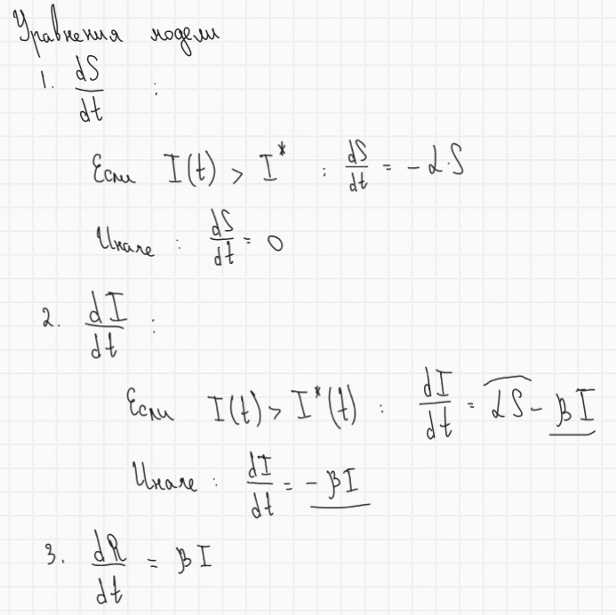
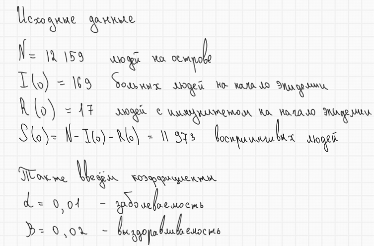
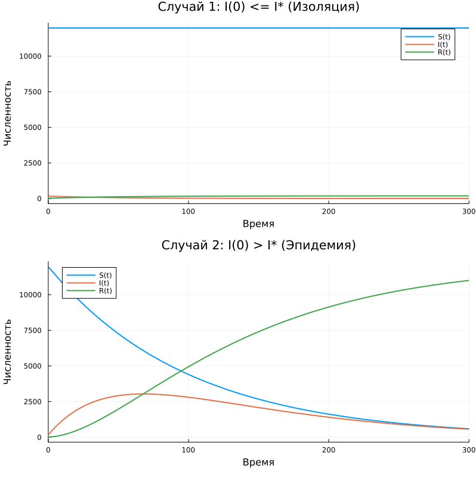

	---
## Author
author:
  name: Комягин Андрей Николаевич
  degrees: DSc
  orcid: 0000-0002-0877-7063
  email: 1132236126@rudn.ru
  affiliation:
    - name: Российский университет дружбы народов
      country: Российская Федерация
      postal-code: 117198
      city: Москва
      address: ул. Миклухо-Маклая, д. 6

## Title
title: "Отчёт по лабораторной работе №6"
subtitle: "Задача об эпидемии"
license: "CC BY"
---

# Цель работы

Рассмотреть и решить задачу об эпидемии
	
# Задание

- Рассмотреть модель эпидемии

- Написать код для моделирования эпидемии на острове для варианта 57

- Ознакомиться с графиком и сделать выводы

# Выполнение лабораторной работы

## Моделирование ситуации

Уравнения модели для задачи об эпидемии([рис. @fig-001]).

{#fig-001 width=70%}


## Условие задачи (вариант 57)

Условие задачи ([рис. @fig-002]).

{#fig-002 width=70%}

Необходимо рассмотреть 2 случая: ([рис. @fig-003]).

{#fig-003 width=70%}

## Результаты моделирования

График для задачи об эпидемии (57 вариант) изображен на ([рис. @fig-004]).

{#fig-004 width=70%}


## Листинг программы


### Julia

```

using DrWatson
@quickactivate "project" 

using DifferentialEquations
using Plots

N = 12159.0
I0 = 169.0
R0 = 17.0
S0 = N - I0 - R0 # 11973

u0 = [S0, I0, R0]
tspan = (0.0, 300.0)

alpha = 0.01
beta = 0.02

# p[1] хранит значение I_star
function epidemic!(du, u, p, t)
    S = u[1]
    I = u[2]
    R = u[3]
    I_star = p[1]
    
    if I > I_star
        # Случай эпидемии (порог превышен)
        du[1] = -alpha * S
        du[2] = alpha * S - beta * I
        du[3] = beta * I
    else
        # Случай изоляции (порог не превышен)
        du[1] = 0.0
        du[2] = -beta * I
        du[3] = beta * I
    end
end

# Случай 1:
# Пусть I* будет больше I(0) (например, 200)
I_star_1 = 200.0 
prob1 = ODEProblem(epidemic!, u0, tspan, [I_star_1])
sol1 = solve(prob1, Tsit5(), dtmax=0.1)

# Случай 2:
# Пусть I* будет меньше I(0) (например, 100)
I_star_2 = 100.0
prob2 = ODEProblem(epidemic!, u0, tspan, [I_star_2])
sol2 = solve(prob2, Tsit5(), dtmax=0.1)

# --- Визуализация ---
p1 = plot(sol1, label=["S(t)" "I(t)" "R(t)"], lw=2,
          title="Случай 1: I(0) <= I* (Изоляция)",
          xlabel="Время", ylabel="Численность")

p2 = plot(sol2, label=["S(t)" "I(t)" "R(t)"], lw=2,
          title="Случай 2: I(0) > I* (Эпидемия)",
          xlabel="Время", ylabel="Численность")

# Сохранение графиков
plot(p1, p2, layout=(2, 1), size=(800, 800))
savefig("lab06.png")
println("Графики сохранены в lab06.png")


```

### OpenModelica


```

model Lab5_Variant57 "Модель эпидемии"
  // Параметры
  parameter Real N = 12159 "Общая численность";
  parameter Real I0 = 169 "Начальное число инфицированных";
  parameter Real R0 = 17 "Начальное число иммунных";
  parameter Real S0 = N - I0 - R0 "Начальное число восприимчивых";
  
  parameter Real alpha = 0.01 "Коэффициент заболеваемости";
  parameter Real beta = 0.02 "Коэффициент выздоровления";
  
  // Критическое значение (меняйте это значение для разных случаев!)
  // Случай 1: поставьте 200. Случай 2: поставьте 100.
  parameter Real I_star = 200; 

  // Переменные
  Real S(start=S0, fixed=true) "Восприимчивые";
  Real I(start=I0, fixed=true) "Инфицированные";
  Real R(start=R0, fixed=true) "Иммунные";

equation
  // Уравнение для S
  if I > I_star then
    der(S) = -alpha * S;
  else
    der(S) = 0;
  end if;

  // Уравнение для I
  if I > I_star then
    der(I) = alpha * S - beta * I;
  else
    der(I) = -beta * I;
  end if;

  // Уравнение для R
  der(R) = beta * I;

  annotation(
    experiment(StartTime = 0, StopTime = 200, Tolerance = 1e-6, Interval = 0.1)
  );
end Lab5_Variant57;

```

## Сравнение реализаций на Julia и OpenModelica

| Характеристика | Julia | OpenModelica |
|----------------|-------|--------------|
| **Парадигма** | Императивная (последовательное выполнение) | Декларативная (описание уравнений) |
| **Подход к решению** | Явный вызов solve() | Автоматическая интеграция |
| **Математическая запись** | Скрыта в численном методе | Близка к математической нотации |


# Выводы

В ходе лабораторной работы я рассмотрел модель задачи об эпидемии и построил график заболевания и выздоровления для своего варианта.
