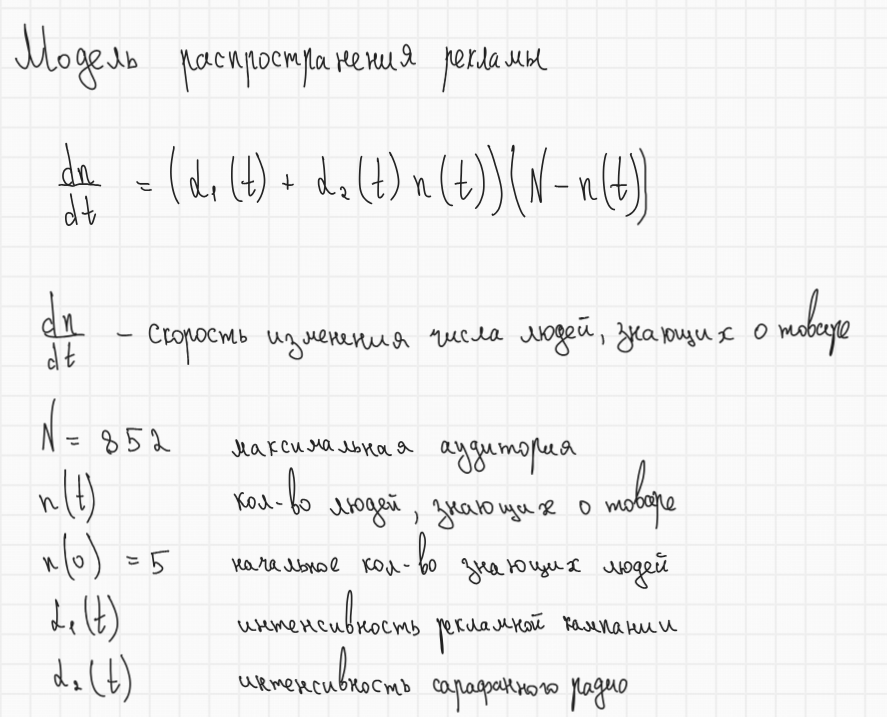
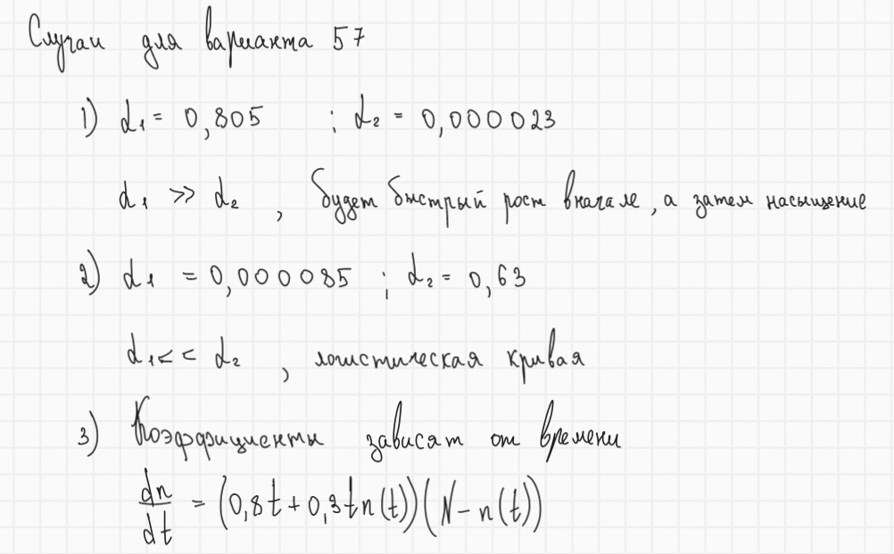
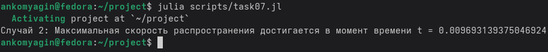
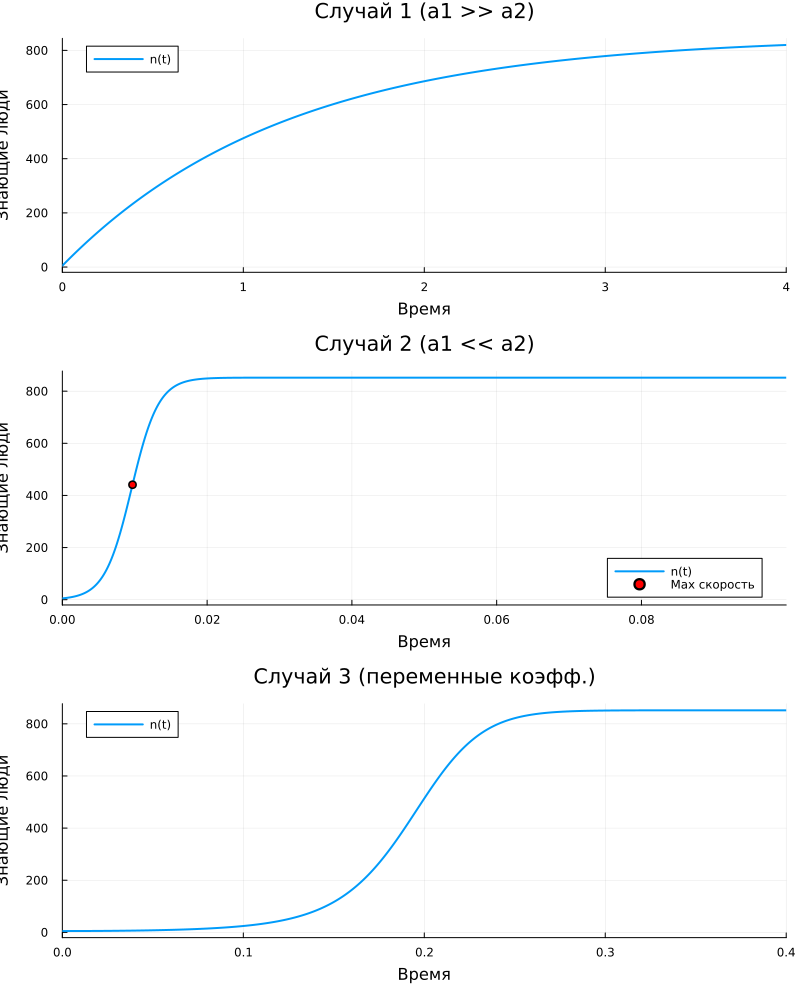

	---
## Author
author:
  name: Комягин Андрей Николаевич
  degrees: DSc
  orcid: 0000-0002-0877-7063
  email: 1132236126@rudn.ru
  affiliation:
    - name: Российский университет дружбы народов
      country: Российская Федерация
      postal-code: 117198
      city: Москва
      address: ул. Миклухо-Маклая, д. 6

## Title
title: "Отчёт по лабораторной работе №7"
subtitle: "Эффективность рекламы"
license: "CC BY"
---

# Цель работы

Изучить модель эффективности рекламы. Сравнить качество рекламной кампании и сарафанного радио
	
# Задание

* Рассмотреть модель рекламы

* Смоделировать различные рекламные ситуации

* Сравнить эффективность реклам с помощью графиков

# Выполнение лабораторной работы

## Условие задачи (вариант 57)

Модель эффективности рекламы можно посмотреть на ([рис. @fig-001]).

{#fig-001 width=70%}

Для моего варианта мне нужно рассмотреть случаи, изображенные на ([рис. @fig-002]).

{#fig-002 width=70%}

Также в задании просят найти время максимальной скорости распространения рекламы для случая, в котором сарафанное радио имеет большую значимость([рис. @fig-003]).

{#fig-003 width=70%}

## Итоговые графики

Итоговые графики изображены на ([рис. @fig-004]).

{#fig-004 width=70%}

## Листинг программы


### Julia

```

using DrWatson
@quickactivate "project"

using DifferentialEquations
using Plots

N = 852.0
n0 = 5.0
u0 = [n0]
tspan_1 = (0.0, 4) 
tspan_2 = (0.0, 0.1) 
tspan_3 = (0.0, 0.4) 

# Случай 1: a1 >> a2
function ad_campaign1!(du, u, p, t)
    n = u[1]
    a1 = 0.805
    a2 = 0.000023
    du[1] = (a1 + a2 * n) * (N - n)
end

# Случай 2: a1 << a2
function ad_campaign2!(du, u, p, t)
    n = u[1]
    a1 = 0.000085
    a2 = 0.63
    du[1] = (a1 + a2 * n) * (N - n)
end

# Случай 3: Зависимость от времени
function ad_campaign3!(du, u, p, t)
    n = u[1]
    a1 = 0.8 * t
    a2 = 0.3 * t
    du[1] = (a1 + a2 * n) * (N - n)
end

# Решаем случай 1
prob1 = ODEProblem(ad_campaign1!, u0, tspan_1)
sol1 = solve(prob1, Tsit5(), reltol=1e-8, abstol=1e-8)

# Решаем случай 2
prob2 = ODEProblem(ad_campaign2!, u0, tspan_2)
sol2 = solve(prob2, Tsit5(), reltol=1e-8, abstol=1e-8)

# Решаем случай 3
prob3 = ODEProblem(ad_campaign3!, u0, tspan_3)
sol3 = solve(prob3, Tsit5(), reltol=1e-8, abstol=1e-8)

# Вычисляем производную dn/dt для каждой точки решения
derivs = [(0.000085 + 0.63 * u[1]) * (N - u[1]) for u in sol2.u]	
max_deriv_val, max_deriv_idx = findmax(derivs)
max_speed_time = sol2.t[max_deriv_idx]

println("Случай 2: Максимальная скорость распространения достигается в момент времени t = $max_speed_time")

p1 = plot(sol1, title="Случай 1 (a1 >> a2)", label="n(t)", xlabel="Время", ylabel="Знающие люди", lw=2)
p2 = plot(sol2, title="Случай 2 (a1 << a2)", label="n(t)", xlabel="Время", ylabel="Знающие люди", lw=2)

scatter!(p2, [max_speed_time], [sol2.u[max_deriv_idx][1]], label="Max скорость", color=:red)

p3 = plot(sol3, title="Случай 3 (переменные коэфф.)", label="n(t)", xlabel="Время", ylabel="Знающие люди", lw=2)

# Объединяем графики
plot(p1, p2, p3, layout=(3, 1), size=(800, 1000))
savefig("lab07.png")

```

### OpenModelica

```

package Lab6_Var57
  
  // Общие параметры можно было бы вынести, но для наглядности пропишем в каждой модели
  
  model Case1 "Случай 1: Высокая эффективность платной рекламы"
    parameter Real N = 852;
    parameter Real n0 = 5;
    Real n(start=n0, fixed=true);
  equation
    der(n) = (0.805 + 0.000023 * n) * (N - n);
    annotation(experiment(StartTime=0, StopTime=10));
  end Case1;

  model Case2 "Случай 2: Высокая эффективность сарафанного радио"
    parameter Real N = 852;
    parameter Real n0 = 5;
    Real n(start=n0, fixed=true);
    Real speed; // Переменная для отслеживания скорости
  equation
    speed = (0.000085 + 0.63 * n) * (N - n);
    der(n) = speed;
    annotation(experiment(StartTime=0, StopTime=0.1));
  end Case2;

  model Case3 "Случай 3: Зависящие от времени коэффициенты"
    parameter Real N = 852;
    parameter Real n0 = 5;
    Real n(start=n0, fixed=true);
  equation
    der(n) = (0.8 * time + 0.3 * time * n) * (N - n);
    annotation(experiment(StartTime=0, StopTime=0.1));
  end Case3;

end Lab6_Var57;

```


## Сравнение реализаций на Julia и OpenModelica

| Характеристика | Julia | OpenModelica |
|----------------|-------|--------------|
| **Парадигма** | Императивная (последовательное выполнение) | Декларативная (описание уравнений) |
| **Подход к решению** | Явный вызов solve() | Автоматическая интеграция |
| **Математическая запись** | Скрыта в численном методе | Близка к математической нотации |


# Выводы

В ходе выполнения лабораторной работы была изучена модель эффективности рекламы. Также сравнили качество рекламной кампании и сарафанного радио
