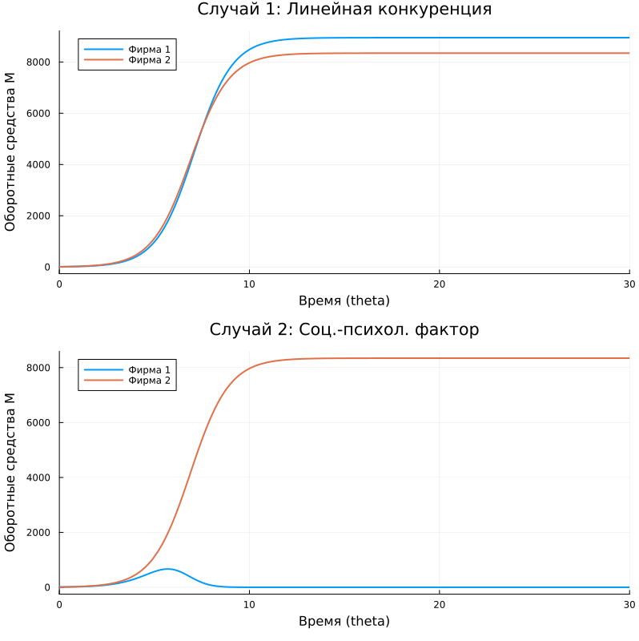

---
## Author
author:
  name: Комягин Андрей Николаевич
  degrees: DSc
  orcid: 0000-0002-0877-7063
  email: 1132236126@rudn.ru
  affiliation:
    - name: Российский университет дружбы народов
      country: Российская Федерация
      postal-code: 117198
      city: Москва
      address: ул. Миклухо-Маклая, д. 6
## Title
title: Лабораторная работа №8
subtitle: Модель конкуренции двух фирм
license: CC BY
date: today
date-format: "YYYY-MM-DD" # Example: 2025-09-06
---

# Информация

## Докладчик

:::::::::::::: {.columns align=center}
::: {.column width="70%"}

  - Комягин Андрей Николаевич
  - студент НПИбд-01-23
  - Российский университет дружбы народов им. П. Лумумбы

:::
::: {.column width="30%"}

:::
::::::::::::::

# Вводная часть

## Цель

Изучить математическую модель конкуренции двух фирм, производящих взаимозаменяемые товары. Построить графики изменения оборотных средств фирм для двух случаев: без учета и с учетом социально-психологических факторов. Сравнить реализацию модели на языках Julia и OpenModelica.

## Задачи

1.  Построить графики изменения оборотных средств фирмы 1 и фирмы 2 без учета постоянных издержек и с веденной нормировкой для случая 1.
2.  Построить графики изменения оборотных средств фирмы 1 и фирмы 2 без учета постоянных издержек и с веденной нормировкой для случая 2.

# Выполнение лабораторной работы

## Условие задачи

**Математическая модель**

Для моделирования конкуренции двух фирм используется система дифференциальных уравнений, описывающая динамику изменения их оборотных средств $M_1$ и $M_2$:

$$
\begin{cases}
\frac{dM_1}{d\theta} = M_1 - \frac{b}{c_1}M_1 M_2 - \frac{a_1}{c_1} M_1^2 \\
\frac{dM_2}{d\theta} = \frac{c_2}{c_1} M_2 - \frac{b}{c_1}M_1 M_2 - \frac{a_2}{c_1} M_2^2
\end{cases}
$$

## Коэффициенты модели

где:

*   $M_1, M_2$ — оборотные средства фирм (в млн. ден. ед.);
*   $\theta = \frac{t}{c_1}$ — безразмерное время.

**Коэффициенты модели** вычисляются по следующим формулам:

$$ a_1 = \frac{p_{cr}}{\tau_1^2 \tilde{p}_1^2 N q}, \quad a_2 = \frac{p_{cr}}{\tau_2^2 \tilde{p}_2^2 N q}, \quad b = \frac{p_{cr}}{\tau_1^2 \tilde{p}_1^2 \tau_2^2 \tilde{p}_2^2 N q} $$
$$ c_1 = \frac{p_{cr} - \tilde{p}_1}{\tau_1 \tilde{p}_1}, \quad c_2 = \frac{p_{cr} - \tilde{p}_2}{\tau_2 \tilde{p}_2} $$

## Исходные данные варианта 57

| Параметр | Значение | Описание |
|---|---|---|
| $p_{cr}$ | 44 | Критическая стоимость продукта |
| $N$ | 45 | Число потребителей |
| $q$ | 1 | Доля оборотных средств, идущая на покрытие переменных издержек |
| $\tau_1$ | 29 | Длительность производственного цикла фирмы 1 |
| $\tau_2$ | 24 | Длительность производственного цикла фирмы 2 |
| $\tilde{p}_1$ | 8.5 | Себестоимость продукта у фирмы 1 |
| $\tilde{p}_2$ | 10 | Себестоимость продукта у фирмы 2 |
| $M_0^1$ | 7.4 | Начальные оборотные средства фирмы 1 |
| $M_0^2$ | 9.4 | Начальные оборотные средства фирмы 2 |

## Случай 2 (Учет социально-психологического фактора)

В данном случае рассматривается ситуация, когда, помимо экономических факторов влияния, вводятся социально-психологические факторы (например, общественное мнение, мода, антиреклама), влияющие на первую фирму. Уравнение для первой фирмы видоизменяется:

$$ \frac{dM_1}{d\theta} = M_1 - (\frac{b}{c_1} + 0.00047)M_1 M_2 - \frac{a_1}{c_1} M_1^2 $$

Уравнение для второй фирмы остается прежним.

## Результаты моделирования

{height=87%}

## Сравнение реализаций на Julia и OpenModelica

| Характеристика | Julia | OpenModelica |
|----------------|-------|--------------|
| **Парадигма** | Императивная (последовательное выполнение) | Декларативная (описание уравнений) |
| **Подход к решению** | Явный вызов solve() | Автоматическая интеграция |
| **Математическая запись** | Скрыта в численном методе | Близка к математической нотации |

## Выводы

В ходе выполнения лабораторной работы была исследована модель конкуренции двух фирм.

- Построена математическая модель на основе системы дифференциальных уравнений, учитывающая производственные издержки, спрос и взаимодействие фирм.

- Выполнено численное решение задачи для двух случаев: стандартной конкуренции и конкуренции с учетом внешнего воздействия на одну из фирм.

- Показано, что введение социально-психологического фактора (в данном случае негативного для первой фирмы) приводит к снижению её оборотных средств и рыночной доли.

